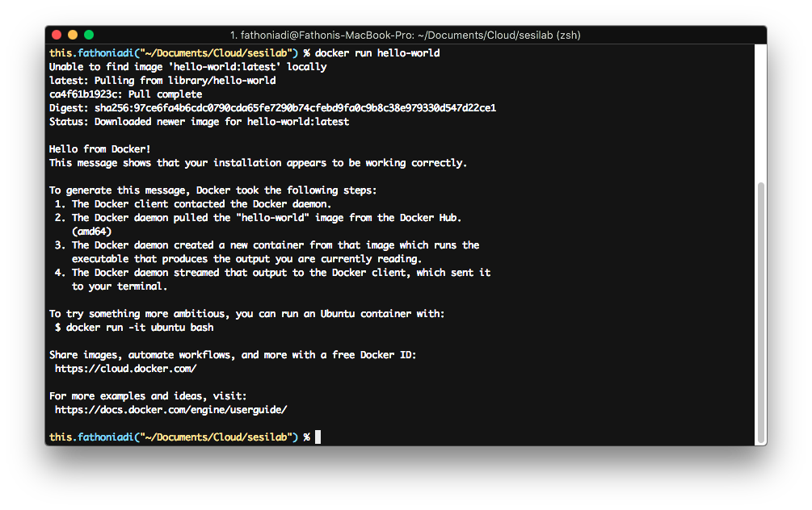
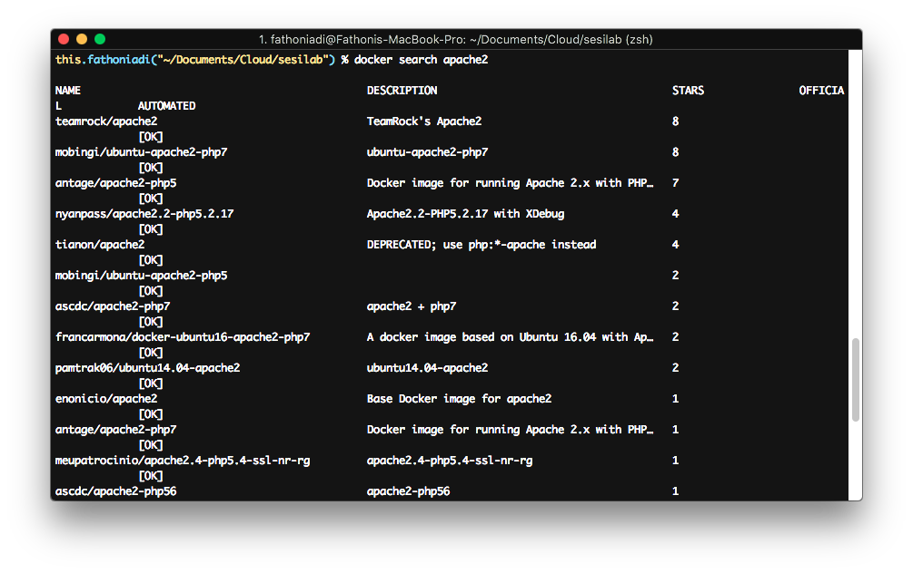
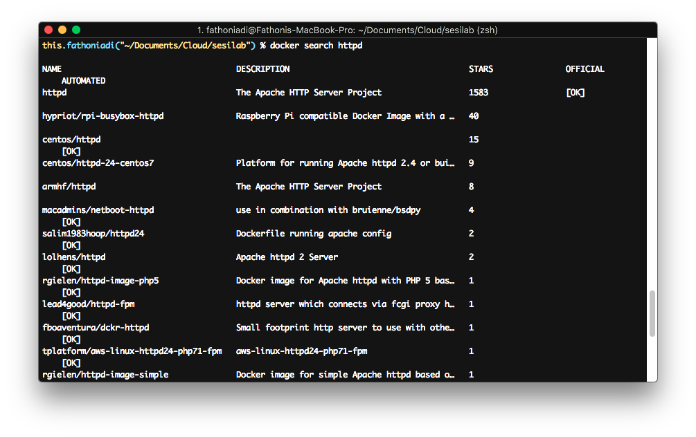
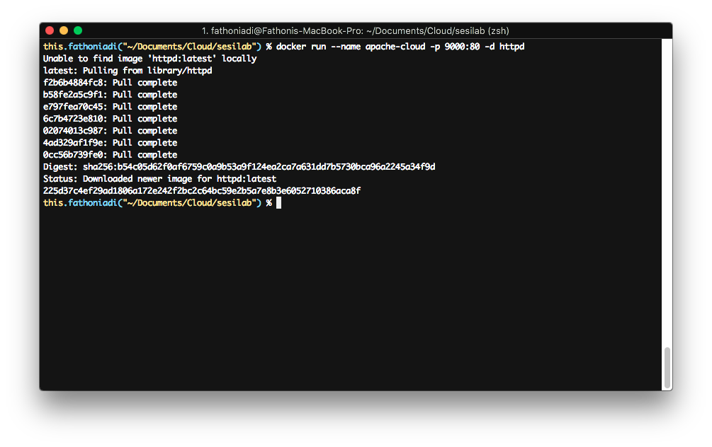
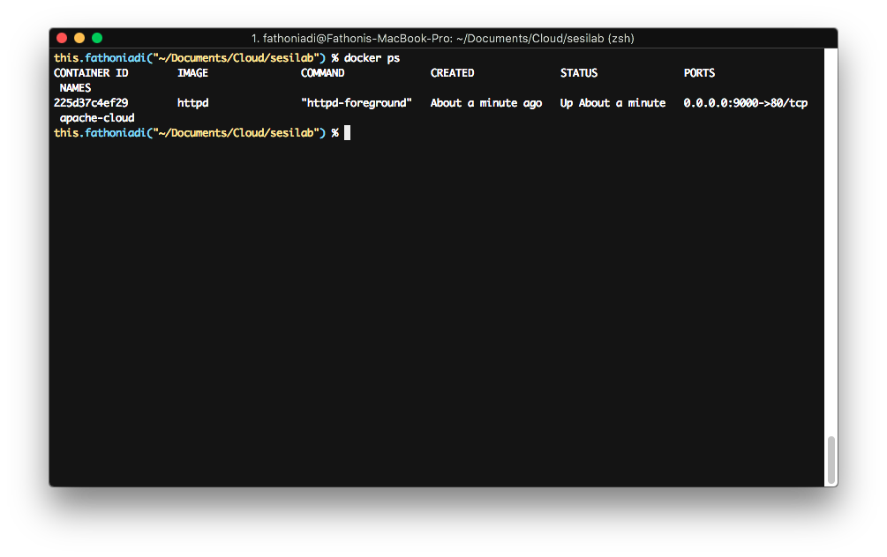
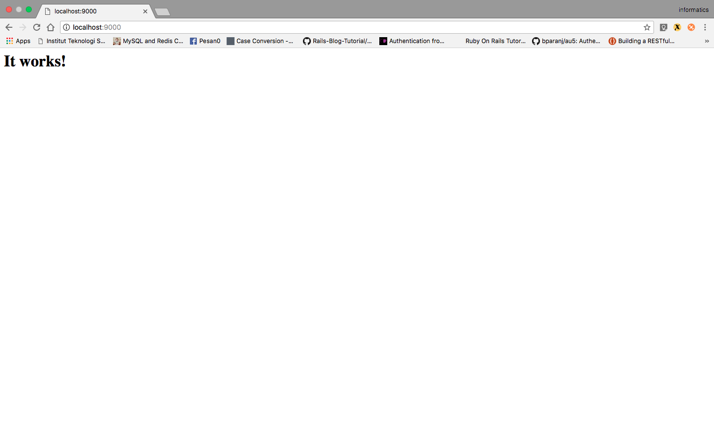
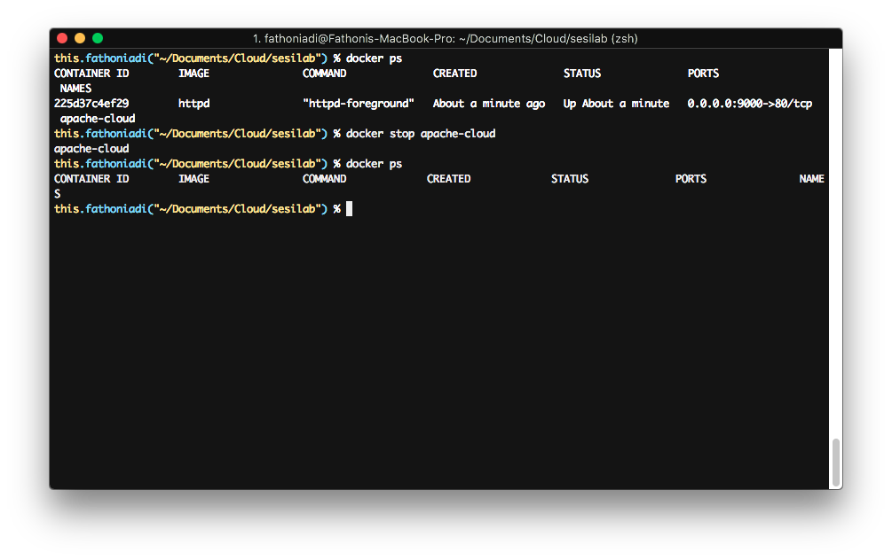
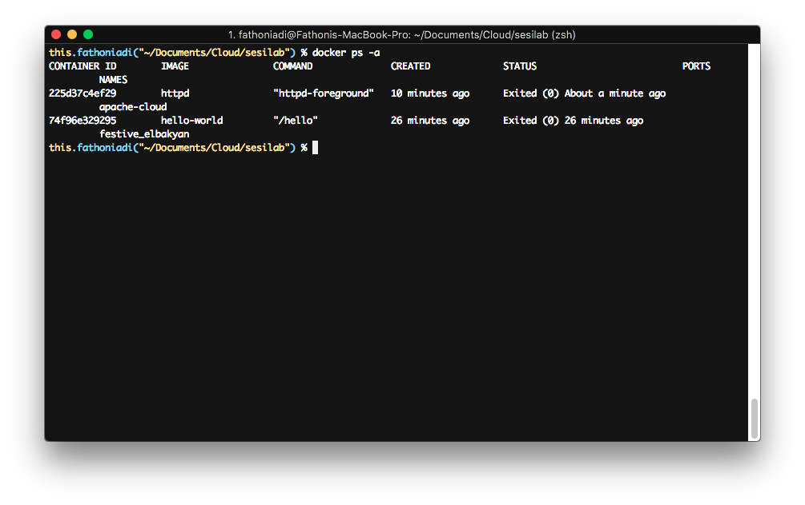
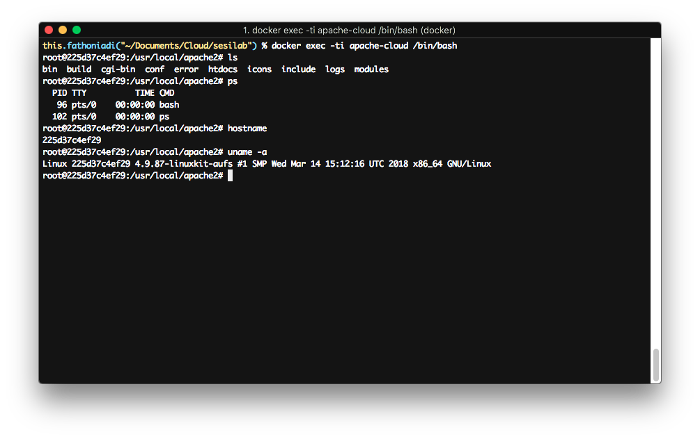
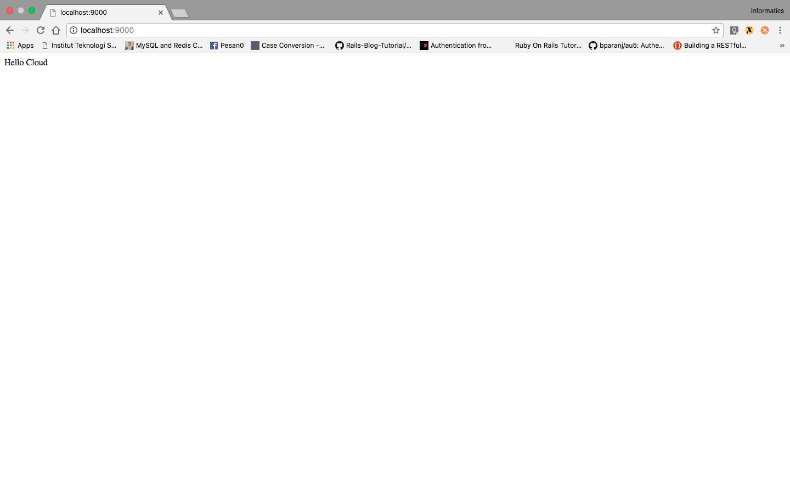

# Docker

### Persyaratan Mengikuti Praktikum
		1. Sudah menginstall Ubuntu 16.04/Unix yang lainnya.
		2. Sudah menginstall Docker CE
		3. Sudah menginstall Docker Compose
		4. Pastikan komputer dapat connect ke Internet

## A. Dasar Teori
### 1. Perbedaan _Virtual Machine_ dengan Docker

### 2. Docker
Docker adalah virtualisasi berbentuk kontainer. Kontainer bekerja lebih efisien daripada virtual mesin, karena yang divirtualisasikan hanya aplikasi dan library yang dibutuhkan saja. Kontainer lebih hemat memory daripada virtual mesin. Untuk memulai menggunakan docker terlebih dahulu mesin docker harus terinstall harus terinstall pada komputer host.

## B. Instalasi

### 1. Instalasi Docker
- Instalasi pada [Ubuntu](https://docs.docker.com/install/linux/docker-ce/ubuntu/#install-docker-ce-1)

### 2. Instalasi Docker Composer
- Instalasi pada [Ubuntu](https://docs.docker.com/compose/install/#linux)

### C. Getting Started
#### C.1 Docker Hello World
Untuk mengecek apakah docker sudah terinstall dengan benar silahkan jalankan perintah

    docker run hello-world

#### C.2 Menjalankan aplikasi apache2 sebagai kontainer
Kali ini kita akan menjalankan apache2 sebagai kontainer. Docker telah menyediakan banyak kontainer dengan macam-macam jenis aplikasi. Untuk melihat apakah apache2 terdapat pada database docker, jalankan perintah berikut.

    docker search apache2

Pada contoh diatas bisa dilihat banyak image container yang disediakan oleh komunitas docker. Namun kita juga bisa mendownload image container resmi dari perusahaan pengembang. Apache2 memiliki nama lain __httpd__.

    docker search httpd

Terdapat hasil pencarian dengan Name httpd dan official ok, berarti kontainer/image tersebut adalah image resmi yang dikeluarkan oleh vendor. Untuk menjalankan kontainer apache2, ikuti langkah-langkah berikut:

1. Download image container

        docker pull httpd

2. Buat kontainer baru menggunakan base image httpd

        docker run --name apache-cloud -p 9000:80 -d httpd
    
    Keterangan :
    - perintah --name digunakan untuk memberikan nama pada kontainer yang akan dibuat.
    - perintah -p digunakan sebagai port forwarding 8080 adalah port pada host, sedangkan 80 adalah port pada kontainer (port forwarding).
    - perintah -d menandakan image kontainer dijalankan sebagai servis.
    - httpd adalah nama image yang digunakan untuk membuat kontainer.

    

3. Setelah berhasil dibuat, jalankan perintah

    `docker ps`

    untuk melihat kontainer yang sedang aktif.

    

4. Cek pada browser

    

5. Beberapa command yang penting untuk diketahui
    - Untuk menghentikan container docker : `docker stop apache-cloud`
    - Untuk menyalankan kembali container docker : `docker start apache-cloud`
    - Untuk me-restart container docker : `docker restart apache-cloud`
    - Untuk menghapus container docker : `docker rm apache-cloud`

    5.1 Contoh menghentikan container docker:

    5.1.1. Jalankan `docker stop apache-cloud`

    

    5.1.2. Pada saat menjalankan `docker ps`, container docker yang ditampilkan __hanya service yang sedang berjalan__. Untuk mengetahui semua service docker jalankan perintah

    `docker ps a`

    

6. Untuk masuk ke container docker (Linux/Mac OS Only), nyalakan kembali container docker apache-cloud, kemudian jalankan

        docker exec -ti apache-cloud /bin/bash

    

#### C.3. Docker Volume
Docker tidak menyimpan state atau data apapun di dalam kontainer. Sehingga jika kontainer mati kemudian dinyalakan lagi maka state akan kembali seperti semula. Semua perubahan tidak tersimpan, berbeda dengan virtual mesin yang menyimpan data dan state. Untuk mengatasi hal tersebut, docker memiliki fungsi volume untuk menyimpan perubahan data pada komputer hostnya. Sehingga ketika kontainer mati atau dihapus, data tetap tersimpan di komputer host dan dapat digunakan kembali oleh kontainer yang sama atau berbeda. Untuk mengaktifkan eksternal volume ikuti langkah-langkah berikut:

1. Matikan dan hapus kotnainer yang telah kita buat sebelumnya.

        docker stop apache-cloud
        docker rm apache-cloud
2. Buat folder baru bernama src dan tambahkan file __index.html__

        mkdir src
        echo "Hello Cloud" > src/index.html

3. Jalankan container.

        docker run --name apache-cloud -v "$PWD"/src:/usr/local/apache2/htdocs/ -p 9000:80 -d httpd

    Keterangan:
    - Argument -v untuk menambahkan docker volume. 
    - perintah __"$PWD"/src:/usr/local/apache2/htdocs/__, akan menghubungkan folder src ke folder htdocs pada kontainer. Perintah __"$PWD"__ digunakan untuk mendapatkan posisi folder saat ini.

4. Buka browser dan akses __http://localhost:9000__

    

    
