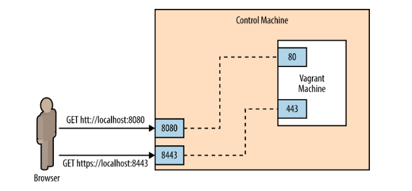

# Vagrant

## A. Dasar Teori
### 1. Virtualiasi
Virtualisasi adalah teknologi untuk membuat sistem operasi dapat berjalan pada lingkungan virtual. Virtualisasi memungkinkan berjalannya beberapa sistem operasi pada satu komputer fisik yang sama pada waktu yang bersamaan. Sistem operasi yang berjalan pada virtualisasi terisolasi dari lingkungan sistem operasi komputer fisiknya, sehingga jika terjadi gangguan pada sistem operasi virtual tidak akan menggangu komputer fisik/host nya. Beberapa contoh teknologi virtualisasi antara lain virtualbox, vmware, vagrant , dan docker.

### 2. Provisioning
Provisioning adalah proses penyediaan aplikasi atau layanan pada komptuasi awan. Provisioning seringkali dilakukan menggunakan virtualisasi. Proses provisioning terdiri dari pembuatan instance virtualisasi, konfigurasi sumber daya, instalasi sistem operasi, instalasi aplikasi atau layanan, dan konfigurasi apliaksi atau layanan yang digunakan. Proses provisioning sering kali menggunakan virtualisasi karena dalam komputasi awan tidak boleh ada down time/layanan mati dalam waktu yang cukup lama. Dengan virtualisasi, proses provisioning menjadi lebih cepat dan mengurangi down time hingga layanan cloud terkesan memiliki zero down time.

### 3. Vagrant
Vagrant adalah kerangka kerja untuk mengelola virtualisasi. Vagrant menciptakan lingkungan virtual yang terisolasi. Vagrant sering digunakan oleh developer yang bekerja dalam sebuah tim. Vagrant memastikan lingkungan pengembangan antar developer sama dan konsisten, sehingga menghilangkan istilah “Ini bekerja pada sistem saya”. Vagrant juga digunakan pada proses provisioning/penyediaan layanan. Vagrant mendukung banyak provider virtualisasi seperti virtualbox, vmware, aws, dan docker.

## B. Instalasi

### 1. Instalasi Virtualbox
Debian Based : `apt-get install virtualbox`

Mac Os : via Official Web dan jalankan file .dmg. [Download](https://www.virtualbox.org/wiki/Downloads)
### 2. Instalasi Vagrant
Debian Based : `apt-get install vagrant`

Mac Os : `brew install vagrant`

### C. Membuat Virtualisasi
Setelah berhasil menginstall vagrant, selanjutnya kita akan mencoba membuat virtualisasi baru menggunakan provider virtualbox. Langkah-langkah pembuatan virtualisasi baru dijelaskan sebagai berikut:

1. Buat folder baru untuk meletakkan konfigurasi.

	`mkdir vagrant-example`
2. Masuk ke dalam folder yang telah di buat.

	`cd vagrant-example`
3. Inisialisasi projek vagrant

	`vagrant init`

	Setelah menjalankan perintah diatas akan dibuat file baru bernama **Vagrantfile**
5. Isi dari **Vagrantfile**
	
		# -*- mode: ruby -*-
		# vi: set ft=ruby :

		# All Vagrant configuration is done below. The "2" in Vagrant.configure
		# configures the configuration version (we support older styles for
		# backwards compatibility). Please don't change it unless you know what
		# you're doing.
		Vagrant.configure("2") do |config|
		  # The most common configuration options are documented and commented below.
		  # For a complete reference, please see the online documentation at
		  # https://docs.vagrantup.com.

		  # Every Vagrant development environment requires a box. You can search for
		  # boxes at https://vagrantcloud.com/search.
		  config.vm.box = "base"

		  # Disable automatic box update checking. If you disable this, then
		  # boxes will only be checked for updates when the user runs
		  # `vagrant box outdated`. This is not recommended.
		  # config.vm.box_check_update = false

		  # Create a forwarded port mapping which allows access to a specific port
		  # within the machine from a port on the host machine. In the example below,
		  # accessing "localhost:8080" will access port 80 on the guest machine.
		  # NOTE: This will enable public access to the opened port
		  # config.vm.network "forwarded_port", guest: 80, host: 8080

		  # Create a forwarded port mapping which allows access to a specific port
		  # within the machine from a port on the host machine and only allow access
		  # via 127.0.0.1 to disable public access
		  # config.vm.network "forwarded_port", guest: 80, host: 8080, host_ip: "127.0.0.1"

		  # Create a private network, which allows host-only access to the machine
		  # using a specific IP.
		  # config.vm.network "private_network", ip: "192.168.33.10"

		  # Create a public network, which generally matched to bridged network.
		  # Bridged networks make the machine appear as another physical device on
		  # your network.
		  # config.vm.network "public_network"

		  # Share an additional folder to the guest VM. The first argument is
		  # the path on the host to the actual folder. The second argument is
		  # the path on the guest to mount the folder. And the optional third
		  # argument is a set of non-required options.
		  # config.vm.synced_folder "../data", "/vagrant_data"

		  # Provider-specific configuration so you can fine-tune various
		  # backing providers for Vagrant. These expose provider-specific options.
		  # Example for VirtualBox:
		  #
		  # config.vm.provider "virtualbox" do |vb|
		  #   # Display the VirtualBox GUI when booting the machine
		  #   vb.gui = true
		  #
		  #   # Customize the amount of memory on the VM:
		  #   vb.memory = "1024"
		  # end
		  #
		  # View the documentation for the provider you are using for more
		  # information on available options.

		  # Enable provisioning with a shell script. Additional provisioners such as
		  # Puppet, Chef, Ansible, Salt, and Docker are also available. Please see the
		  # documentation for more information about their specific syntax and use.
		  # config.vm.provision "shell", inline: <<-SHELL
		  #   apt-get update
		  #   apt-get install -y apache2
		  # SHELL
		end

4. Pada contoh kasus ini kita ingin menggunakan os Ubuntu (14.04) Precise 64 bit. Maka dari itu kita perlu download **Vagrant Box** terlebih dahulu. Dengan cara:

	`vagrant box add hashicorp/precise64`

5. Kemudian jika box mendukung lebih dari satu provider akan ditanyakan provider yang akan digunakan. Pilih provider **virtualbox**.
6. Setting box pada Vagrant file dengan cara ganti vm.box yang awalnya **base** menjadi **hashicorp/precise64**

		config.vm.box = "base"
	menjadi

		config.vm.box = "hashicorp/precise64"
7. Simpan file Vagrantfile

### D. Konfigurasi Resource Virtual Machine
Layaknya komputer fisik, virtual machine terdapat memory dan core cpu. Pada **Vagrant**, resource core dan memory virtual machine diatur pada **Vagrantfile**. Untuk mengatur resource virtual machine dapat dilakukan dengan langkah berikut:

1. Uncomment konfigurasi

		config.vm.provider "virtualbox" do |vb|
		   # Display the VirtualBox GUI when booting the machine
		   # vb.gui = true
		
		   # Customize the amount of memory on the VM:
			vb.memory = "1024"
		end
2. Untuk menentukan resource memory yang diperlukan ganti value 

	`vb.memory`
3. Untuk mengatur core cpu, tambahkan baris sebelum **end**.

		config.vm.provider "virtualbox" do |vb|
		   # Display the VirtualBox GUI when booting the machine
		   # vb.gui = true
		
		   # Customize the amount of memory on the VM:
			vb.memory = "1024"
			vb.cpus = 2 
		end

4. Untuk storage tidak dapat diatur oleh vagrant. Mungkin bisa diatur melalui Hypervisor yang digunakan.

### E. Cara Bermain
1. Menjalankan vagrant : `vagrant up`
2. Untuk masuk ke virtual machine : `vagrant ssh`
3. Untuk mematikan virtual machine : `vagrant halt`
4. Untuk menghapus virtual machine : `vagrant destroy`
5. Untuk merestart virtual machine dan akan memuat ulang konfigurasi **Vagrantfile** : `vagrant destroy`
6. 

### F. Konfigurasi Internet Pada Virtual Machine
Pada vagrant terdapat 3 jenis konfigurasi agar virtual machine dapat diakses dari host maupun dari luar host.

1. Port Forwarders

	Pada linkungan produksi, aplikasi yang berjalan di virtualisasi harus dapat diakses melalui komputer hostnya. Akses ini dilakukan dengan mekanisme port forwarders . Port forwarders bekerja dengan cara meneruskan akses dari port komputer host menuju port tertentu pada virtualisasi. Port forwarders dapat diilustrasikan dengan gambar berikut. 

	

	Klien mengakses port 8080/8443 pada komputer host, kemudian akan diteruskan menuju port 80/443 pada virtualisasi vagrant. Untuk mengaktifkan port forwarders, terdapat step-step sebagai berikut:

	1. Uncomment baris agar port 80 VM dapat diakses melalui port 8080 host

			config.vm.network "forwarded_port", guest: 80, host: 8080, host_ip: "127.0.0.1"
		dan hapus 

			host_ip: "127.0.0.1"
		agar bisa diakses dari luar host. Sehingga menjadi

			config.vm.network "forwarded_port", guest: 80, host: 8080
	2. Tambahkan baris

			config.vm.network "forwarded_port", guest: 443, host: 8443
		agar port 443 pada virtual machine dapat diakses melalui port 8443
2. Static Local IP

	Ketika banyak virtualisasi yang dijalankan, kita membutuhkan alamat IP lokal agar antar virtualisasi dapat saling berkomunikasi. IP lokal hanya dapat diakses oleh komputer host dan virtualisasi pada komputer host yang sama. Untuk menentukan alamat IP pada virtualisasi lakukan step-step berikut:

	1. Uncomment baris :

			config.vm.network "private_network", ip: "192.168.33.10"
		Virtual machine dapat kita akses melalui ip **192.168.33.10**

		Untuk pemilihan IP, pilihlah ip dengan angka belakang 2-254, karena ip dengan angka belakang 1 sudah digunakan oleh komputer host sebagai router antar virtualisasi. Alamat IP lokal antar virtualisasi tidak perlu harus dalam subnet yang sama. Alamat IP pada subnet yang berbeda tetap bisa berkomunikasi, karena mekanisme routing telah diatur oleh vagrant.
3. Bridged IP

	Pada kondisi tertentu dibutuhkan virtualisasi yang dapat di akses dari luar, contohnya pada layanan cloud vps(virtual private server). Untuk membuat virtualisasi dapat diakses dari luar, dibutuhkan mekanisme yang disebut bridging . Mekanisme bridging ini telah ditangani oleh vagrant. Untuk mengaktifkan fungsi bridged ikuti langkah-langkah berikut:

	* Untuk DHCP: 
		1. Uncomment baris:

				config.vm.network "public_network"

	* Untuk konfigurasi IP static pada virtualiasasi gunakan konfigurasi berikut

			config.vm.network "public_network", ip: "10.151.36.225"

		Ip tergantung subnet dari host

